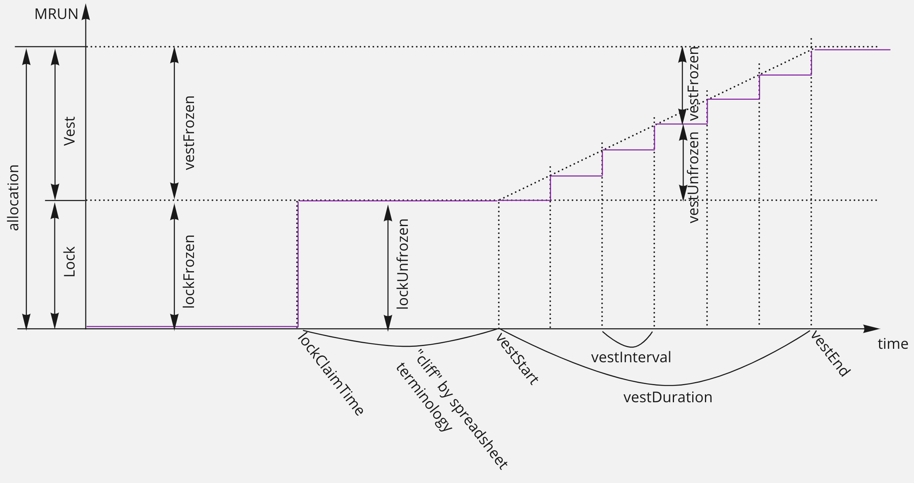

# MRUN Ethereum Contracts

[](audits/2022.04-MetarunToken-Audit-by-OnGrid.pdf)
[](https://openzeppelin.com/)
[](https://docs.soliditylang.org/en/v0.8.11/)
[](https://github.com/metarungame/metarun-contracts/actions/workflows/test.yml)

## BEP-20 token specification

* Network: `BNB Chain (ex. Binance Smart Chain or BSC)`
* Contract address: [0xCa0D640a401406f3405b4C252a5d0c4d17F38EBb](https://bscscan.com/token/0xCa0D640a401406f3405b4C252a5d0c4d17F38EBb)
* Standard: `BEP-20 (ERC-20 compatible)`
* Name: `METARUN`
* Symbol: `MRUN`
* Supply: `dynamic, capped at 1,000,000,000. It will be minted as per requirement. At the time of deployment there should be no supply minted.`
* Mintable: `Yes, by MINTER_ROLE`
* Burnable: `Yes, holder can burn his amount`
* Pausable: `No`
* Upgradeable: `No`
* AccessControl: `RoleBased: DEFAULT_ADMIN_ROLE, MINTER_ROLE`

## Deploy and verify

```sh
export MNEMONIC=<YOUR_MNEMONIC>
export ETHERSCAN_API_KEY=<YOUR ETHERSCAN KEY>
yarn
yarn hardhat deploy --network <bsc or polygon>
yarn hardhat etherscan-verify --network <bsc or polygon>
```

## Tasks

* `idoPoolClient` - allows to pay, claim, release, withdrawNotSoldTokens and withdrawFunds. With time-traveling feature of hardhat this is useful for manual testing. The example snippet that illustrated IDO lifecycle:

```sh
yarn hardhat idoPoolClient --network polygon --amount 700 --action pay
# forward to start
yarn hardhat idoPoolClient --network polygon --action timeForward --time 2022-02-20T17:00:00+00:00
yarn hardhat idoPoolClient --network polygon --amount 651 --action pay
# forward to end
yarn hardhat idoPoolClient --network polygon --action timeForward --time 2022-02-22T16:00:00+00:00
yarn hardhat idoPoolClient --network polygon --action claim
# forward to release
yarn hardhat idoPoolClient --network polygon --action timeForward --time 2023-02-20T19:00:00+00:00
yarn hardhat idoPoolClient --network polygon --action release
yarn hardhat idoPoolClient --network polygon --action withdrawFunds
```

* `mint-tokens` and `simplified-mint-tokens` - mints MetarunCollection NFT tokens

Also find some useful scripts in deployments like `SelfSend` and `MetarunIDO`
### Submit balances snapshot to a TierSystem contract (0bsolete)

To add balances snapshot to the TierSystem contract:
* Put CSVs from etherscan and execute `scan_staking_farming_balances.py` in the root repo
* Rut JSON file produced by the script to `tokens-snapshot` folder as `holders.json`
* Run task `writeBalancesToTierSystem:polygon`. The value of balance-list-length is set based on gasLimit on the network

Note: Hardhat tasks in this repo for balances parsing and snapshot preparation are deprecated and were removed because
they accounted just ERC-20 balances, and farming/staking deposits were ignored.

# Vesting contracts

Hold and gradually releases allocated funds to investors. Funds are divided into two volumes accounted independently:

* TimeLocked portion gets entirely released after `lockClaimTime`
* Vested portion gets released gradually after vestStart and ends on `vestStart + vestDuration`


